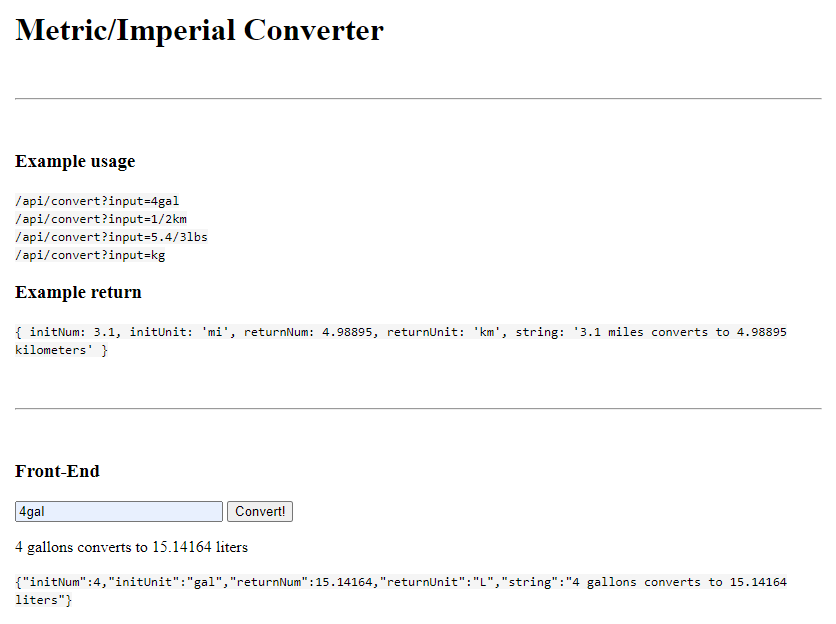

# Metric-Imperial Converter

This is the boilerplate for the Metric-Imperial Converter project. Instructions for building this project can be found at https://www.freecodecamp.org/learn/quality-assurance/quality-assurance-projects/metric-imperial-converter



## Installation

```
git clone https://github.com/R3D4N/MetricImperialConverter.git
cd ../path/to/the/file
npm install
npm start
```

## Technologies
* NodeJS
* Express
* Chai
* Chai-http
* Mocha
* Replit
